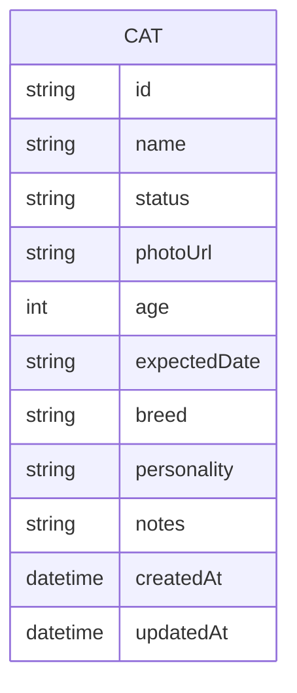
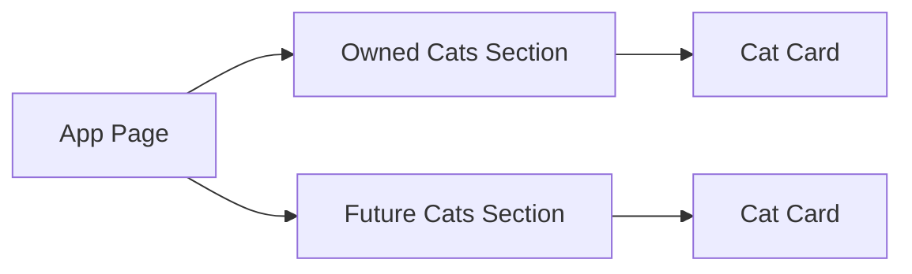

# Cat Website v1 - Design Doc

## 1) Goal
Build a simple website to present:
1. **Cats we currently own**
2. **Cats planned / expected in the future**

This v1 is intentionally small and readable. Future scope (subscribe, cat-care tips, payments) is deferred.

---

## 2) Product scope

### In scope (v1)
- Landing page with two sections:
  - **Our Cats** (owned cats)
  - **Future Cats** (planned / expected)
- Card-based display with photo, name, status, short notes
- Lightweight admin data source (JSON file)

### Out of scope (later)
- User login
- Subscription/notification features
- Payment flows
- CMS dashboard

---

## 3) Functional requirements

### 3.1 Show owned pets
- Display all cats with `status = owned`
- Show fields: `name`, `photo`, `age`, `personality`, `notes`

### 3.2 Show future/planned pets
- Display all cats with `status = planned`
- Show fields: `name`, `expected_date`, `breed(optional)`, `notes`

### 3.3 Basic UX
- Mobile-friendly layout
- Fast load and simple navigation

---

## 4) Proposed architecture

For v1, use a simple static/frontend app with local JSON data.

```mermaid
flowchart TD
    U[User Browser] --> FE[Frontend App\n(HTML/CSS/JS or React)]
    FE --> DATA[cat-data.json]

    subgraph Website
      FE
      DATA
    end
```

### Why this architecture
- Minimal complexity
- Easy to iterate
- No backend cost for first release
- Clear migration path to API/DB later

---

## 5) Data model (v1)



### Example record
```json
{
  "id": "cat_001",
  "name": "Mochi",
  "status": "owned",
  "photoUrl": "/images/mochi.jpg",
  "age": 2,
  "expectedDate": null,
  "breed": "Ragdoll",
  "personality": "playful, cuddly",
  "notes": "Loves feather toys"
}
```

---

## 6) Component design



### UI sections
- **Header:** project title + short intro
- **Owned Cats:** list/grid of current pets
- **Future Cats:** planned pets and expected timeline

---

## 7) File layout proposal

```text
cat-site/
  public/
    images/
  src/
    components/
      CatCard.tsx
      CatSection.tsx
    data/
      cat-data.json
    pages/
      Home.tsx
```

---

## 8) Non-functional requirements
- Keep Time-to-Interactive low (static assets)
- Accessibility basics (alt text, semantic headings)
- Easy content updates through one JSON file

---

## 9) Future roadmap
1. **Subscribe module** (email or Telegram updates for future kittens)
2. **Cat raising tips** section (articles/checklists)
3. **Payments** (donation/adoption-related flows)
4. Move from local JSON to backend API + database

---

## 10) Review checklist
- [ ] Requirements capture owned vs future cats clearly
- [ ] Diagram is understandable for non-web specialists
- [ ] Data fields are sufficient for v1
- [ ] Scope boundaries are explicit

