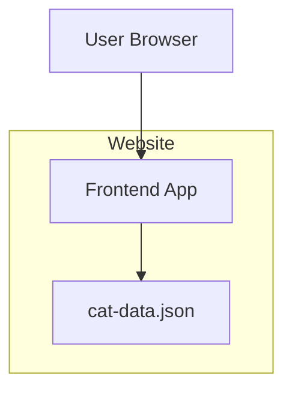
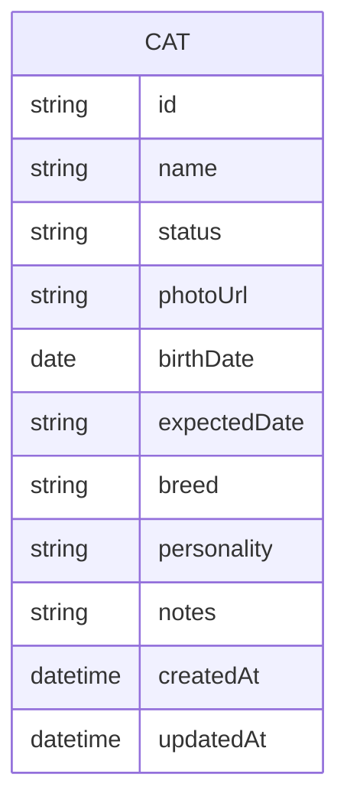
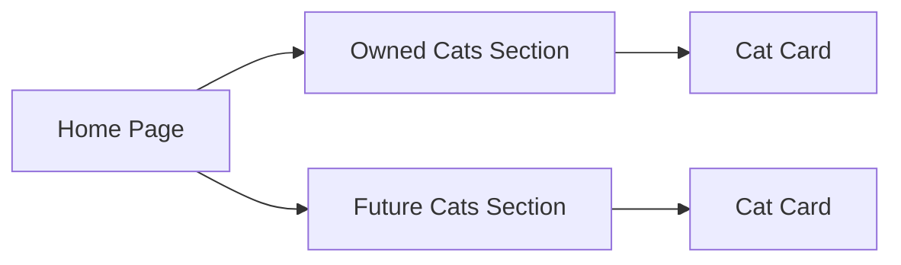

# Cat Website v1 - Design Doc

## 1) Goal
Build a simple website to present:
1. **Cats we currently own**
2. **Cats planned / expected in the future**

This v1 is intentionally small and readable. Future scope (subscribe, cat-care tips, payments) is deferred.

---

## 2) Product scope

### In scope (v1)
- Landing page with two sections:
  - **Our Cats** (owned cats)
  - **Future Cats** (planned / expected)
- Card-based display with photo, name, status, short notes
- JSON data file for easy content updates (no rebuild needed if hosted statically)

### Out of scope (later)
- User login
- Subscription/notification features
- Payment flows
- CMS dashboard

---

## 3) Functional requirements

### 3.1 Show owned pets
- Display all cats with `status = owned`
- Show fields: `name`, `photo`, `birthDate` (computed to age), `personality`, `notes`

### 3.2 Show future/planned pets
- Display all cats with `status = planned`
- Show fields: `name`, `expectedDate`, `breed(optional)`, `notes`
- age/birthDate fields are null for planned cats (display handles this)

### 3.3 Basic UX
- Mobile-friendly layout
- Fast load and simple navigation

---

## 4) Proposed architecture

For v1, use a simple static/frontend app with local JSON data.



### Why this architecture
- Minimal complexity
- Easy to iterate
- No backend cost for first release
- JSON file lets you add/edit cats without touching code (just edit JSON and redeploy)
- Clear migration path to API/DB later

### Why React + TypeScript
- Component-based = easy to reuse CatCard for both sections
- Type safety catches data model mismatches early
- Static export (`next export` or `vite build`) gives you static files for cheap/free hosting
- JSON lives in `/public`, fetched at runtime — editable without rebuild on some platforms (or just redeploy)

---

## 5) Data model (v1)



### Notes on fields
- `birthDate`: stored as date string (e.g., "2022-03-15"), computed to "2 years old" at display time
- `expectedDate`: only used for planned cats (null for owned cats)
- `birthDate`: null for planned cats (display shows "Coming soon" instead of age)

### Example records
```json
{
  "id": "cat_001",
  "name": "Mochi",
  "status": "owned",
  "photoUrl": "/images/mochi.jpg",
  "birthDate": "2022-03-15",
  "expectedDate": null,
  "breed": "Ragdoll",
  "personality": "playful, cuddly",
  "notes": "Loves feather toys"
}
```

```json
{
  "id": "cat_002",
  "name": "Sakura",
  "status": "planned",
  "photoUrl": "/images/sakura-placeholder.jpg",
  "birthDate": null,
  "expectedDate": "2025-06",
  "breed": "Scottish Fold",
  "personality": null,
  "notes": "Expecting litter in June 2025"
}
```

---

## 6) Component design



### UI sections
- **Header:** project title + short intro
- **Owned Cats:** grid of current pets with computed ages
- **Future Cats:** upcoming cats with expected dates

---

## 7) File layout proposal

```text
cat-site/
  package.json          # React + TypeScript deps, build scripts
  tsconfig.json         # TypeScript config
  vite.config.ts        # Build tool (Vite recommended for simplicity)
  public/
    cat-data.json       # Editable data file (lives here for easy updates)
    images/
      mochi.jpg
      sakura-placeholder.jpg
  src/
    components/
      CatCard.tsx       # Reusable card component
      CatSection.tsx    # Section wrapper with title
    data/
      types.ts          # TypeScript interfaces for Cat
    pages/
      Home.tsx          # Main page with Owned + Planned sections
    utils/
      ageCalculator.ts  # Compute age from birthDate
```

---

## 8) Non-functional requirements

### Performance
- Keep Time-to-Interactive low (static assets, lazy-load images)
- JSON file < 100KB for fast fetch

### Accessibility (specifics)
- Alt text on all cat photos describing the cat
- Semantic heading hierarchy (h1 for site title, h2 for section headers)
- Keyboard navigable cards (tabindex, Enter to open detail view)
- Color contrast > 4.5:1 for text

### Content updates
- Edit `public/cat-data.json` to add/remove/update cats
- Redeploy (most static hosts auto-deploy on git push)

---

## 9) Future roadmap

1. **Subscribe module** (email or Telegram updates for future kittens)
2. **Cat raising tips** section (articles/checklists)
3. **Payments** (donation/adoption-related flows)
4. Move from local JSON to backend API + database when content grows

---

## 10) Review checklist

- [ ] Requirements capture owned vs future cats clearly
- [ ] Diagram is understandable for non-web specialists
- [ ] Data model handles both owned and planned cats without ambiguity
- [ ] Data fields are sufficient for v1
- [ ] Scope boundaries are explicit
