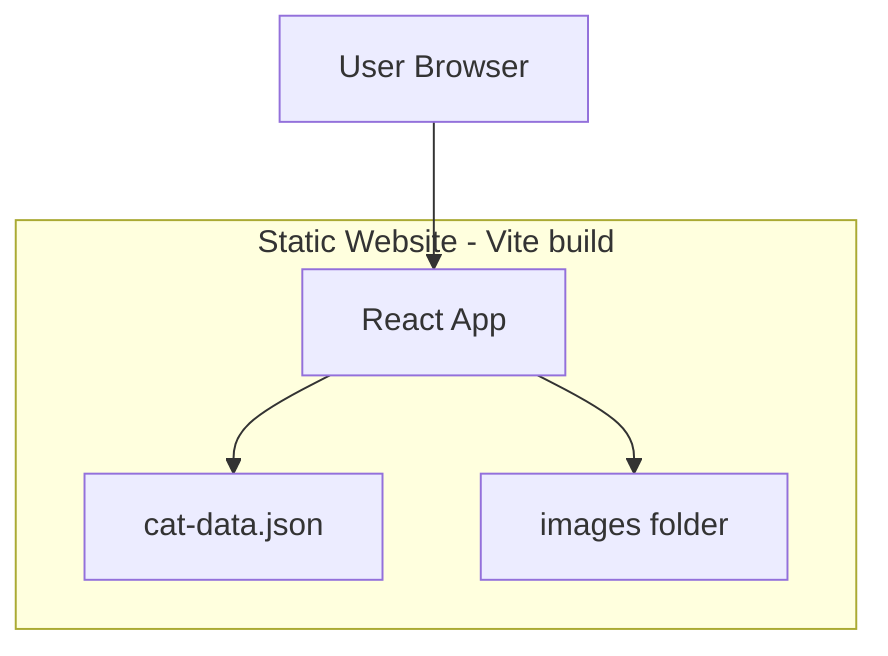
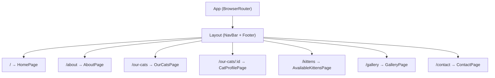
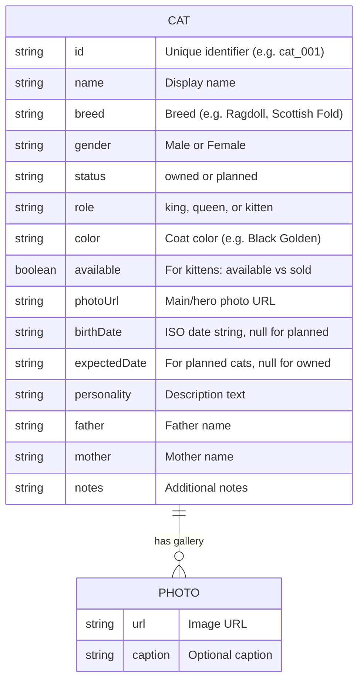
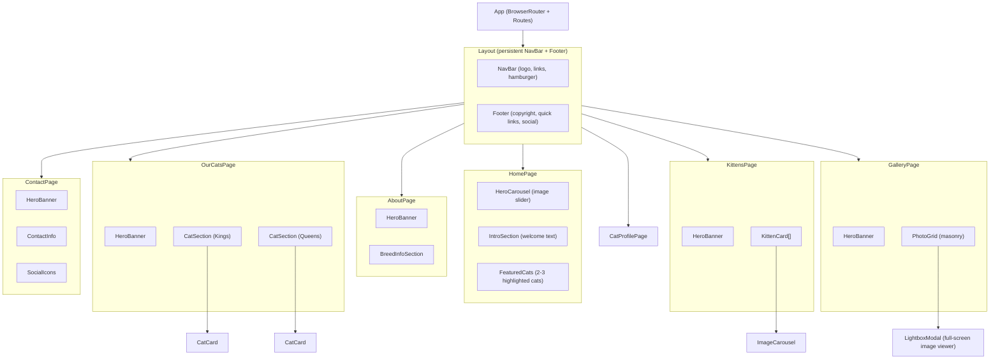

# Cat Website — Design Doc (v2)

> **v2 update (Feb 2026):** Expanded from a single-page list to a multi-page cattery website
> inspired by professional breeders like Peach Blossom Cattery. v1 design preserved in git history.

---

## 1) Goal

Build a polished cattery website that:
1. **Showcases breeding cats** (Kings & Queens) with large photos and lineage
2. **Lists available kittens** with personality, photos, and availability status
3. **Presents the cattery brand** — hero imagery, breed info, and a warm visual identity
4. **Provides contact info** — email, social media, and a call-to-action for inquiries

The site remains a static frontend (no backend) with JSON-driven data for easy content updates.

---

## 2) Product scope

### In scope (v2)
| Page | Description |
|------|-------------|
| **Home** | Hero image carousel, cattery intro/philosophy, featured cats |
| **About / At a Glance** | Breed information — why choose this breed, characteristics |
| **Our Cats** | Parent cats split into Kings (males) and Queens (females) |
| **Cat Profile** | Detail page per cat — hero photo, personality, gallery, lineage |
| **Available Kittens** | Grid of kittens with multi-photo carousel, personality, sold/available status |
| **Gallery** | Full photo gallery with masonry grid and lightbox modal |
| **Contact** | Contact info (email, social links), hero banner |

### Carried over from v1
- JSON data file for easy content updates (no rebuild needed)
- Card-based display with photo, name, status
- Mobile-friendly responsive layout
- Accessibility (ARIA, keyboard navigation, semantic HTML)

### Out of scope (later)
- User login / accounts
- Subscription / notification features
- Payment / adoption flows
- CMS dashboard
- Backend API / database

---

## 3) Functional requirements

### 3.1 Navigation
- Persistent top navigation bar on all pages with logo + links
- Links: Home, About, Our Cats, Available Kittens, Gallery, Contact
- Mobile: hamburger menu that toggles a slide-out or dropdown nav
- Active page highlighted in nav

### 3.2 Home page
- Full-width hero image carousel (auto-advances, manual arrows)
- Welcome section with cattery name, tagline, and philosophy text
- Featured cats section highlighting 2–3 cats from the data

### 3.3 About page
- Hero banner with page title over a background image
- Breed info sections (e.g. "Why Choose British Shorthair", "Why Choose British Longhair")
- Large featured photo alongside text

### 3.4 Our Cats page
- Hero banner
- Two sections: **Kings** (male breeders) and **Queens** (female breeders)
- Each cat displayed with large photo, breed/color description, and name
- Clicking a cat navigates to their profile page

### 3.5 Cat Profile page (enhanced from v1)
- Large hero photo with status badge
- Info section: name, breed, gender, age (computed from birthDate), color
- Personality description
- Photo gallery (grid of additional images)
- Parent lineage (father/mother names)
- For planned/available cats: CTA section with contact prompt

### 3.6 Available Kittens page
- Hero banner
- Grid of kitten cards, each with:
  - Mini image carousel (multiple photos per kitten, prev/next controls)
  - Name with gender, e.g. "Pomelo (Female)"
  - Breed color description
  - Personality paragraph
  - Status badge: "Available" or "Sold"
- Clicking a kitten navigates to their profile page

### 3.7 Gallery page
- Hero banner
- Masonry-style responsive photo grid
- Each photo has an optional breed/cat caption
- Click-to-enlarge lightbox modal with prev/next navigation

### 3.8 Contact page
- Hero banner
- Contact information: email, WeChat, Instagram, etc.
- Social media icon links (Instagram, Facebook, etc.)
- Note about preferred contact method

### 3.9 Footer (all pages)
- Cattery name and copyright
- Quick links to main pages
- Social media icons

---

## 4) Architecture

### 4.1 High-level data flow

Still a static frontend app — no backend. Data lives in a JSON file fetched at runtime.



### 4.2 Routing architecture (new in v2)

v1 used `useState` to toggle between list and profile views. v2 uses **React Router** for
proper multi-page navigation with URL support, back/forward, and deep linking.



### 4.3 Why React Router over state-based routing
- **Deep linking:** Users can bookmark or share `/our-cats/cat_001` directly
- **Browser navigation:** Back/forward buttons work as expected
- **URL reflects state:** Current page is visible in the address bar
- **Scalability:** Adding pages doesn't require more useState logic in App
- **SEO-friendly:** Each page has its own URL path

### 4.4 Why keep React + TypeScript + Vite
- Everything from v1 still applies (component reuse, type safety, fast builds)
- Vite's dev server supports client-side routing out of the box
- `vite build` produces static files — same deployment story as v1

---

## 5) Data model (v2)

### 5.1 Cat entity (updated)



> **What is PHOTO?** Each cat can have multiple additional photos beyond its main `photoUrl`.
> These extra photos are stored in a `gallery` array on the Cat object. Each gallery entry is
> a PHOTO — just an image URL and an optional text caption. For example, Mochi's profile page
> might show her main photo at the top, then a gallery grid below with photos captioned
> "Playing with feather toy" and "Nap time on the couch". The `||--o{` arrow means
> "one Cat has zero or many Photos" (the `o{` means optional/many).

### 5.2 New fields explained

| Field | Type | Why added |
|-------|------|-----------|
| `role` | `'king' \| 'queen' \| 'kitten'` | Distinguishes breeding males, breeding females, and kittens for display on different pages. Works alongside `status` which tracks owned/planned. |
| `color` | `string` | Coat color description (e.g. "Black Golden Longhair"). Displayed on kitten cards and profile pages. Common in cattery websites. |
| `available` | `boolean` | For kittens only. `true` = available for adoption, `false` = sold/reserved. Drives the status badge on kitten cards. |

### 5.3 Site configuration (new)

A new `siteConfig` object in `cat-data.json` stores cattery-wide settings so content
editors can update branding without touching code.

> **Why a single JSON file? What are the alternatives?**
>
> | Approach | Pros | Cons |
> |----------|------|------|
> | **Single JSON file** (current) | Simple, one file to edit, no build step needed, works with any static host | All data in one place can get large, no validation on edit, manual editing is error-prone |
> | **Multiple JSON files** (e.g. `cats.json`, `site-config.json`, `gallery.json`) | Separation of concerns, smaller files, different people can edit different files | More fetch calls on page load, more files to manage |
> | **Markdown/MDX files per cat** (like a blog) | Each cat gets its own file, easy to add new cats, content feels natural | Requires a build step to transform to data, more complex setup |
> | **Headless CMS** (e.g. Contentful, Sanity, Strapi) | Visual editing UI, validation, image hosting, multi-user | External dependency, potential cost, more complex deployment |
> | **Backend API + database** | Full CRUD, search, filtering, scales well | Need to build/host a server, authentication, much more complexity |
>
> For v2 we stick with **single JSON** because it's the simplest path that works.
> When the file grows past ~50 cats, consider splitting into multiple JSON files
> or migrating to a headless CMS. This is tracked in the future roadmap (section 11).

```json
{
  "siteConfig": {
    "catteryName": "My Cattery",
    "tagline": "Where cute, healthy, and friendly cats blossom",
    "heroImages": ["/images/hero-1.jpg", "/images/hero-2.jpg"],
    "introText": "Welcome to our cattery...",
    "contact": {
      "email": "contact@example.com",
      "instagram": "@mycattery",
      "facebook": "mycattery",
      "wechat": "mycattery"
    },
    "about": {
      "breedName": "British Shorthair",
      "breedDescription": "Known for their chubby face...",
      "whyChoose": ["Friendly temperament", "Great with families"]
    }
  },
  "galleryImages": [
    { "url": "/images/gallery-1.jpg", "caption": "Black Golden British Shorthair" }
  ],
  "cats": [ ... ]
}
```

### 5.4 Example cat records (v2)

**King (breeding male):**
```json
{
  "id": "cat_003",
  "name": "Chou Bao",
  "status": "owned",
  "role": "king",
  "breed": "British Shorthair",
  "color": "Black Golden",
  "gender": "Male",
  "photoUrl": "/images/choubao.jpg",
  "birthDate": "2021-06-10",
  "personality": "Calm and regal, loves sunbathing by the window",
  "gallery": [
    { "url": "/images/choubao-2.jpg", "caption": "Relaxing on his favorite spot" }
  ]
}
```

**Kitten (available):**
```json
{
  "id": "cat_004",
  "name": "Pomelo",
  "status": "owned",
  "role": "kitten",
  "breed": "British Longhair",
  "color": "Black Golden Longhair",
  "gender": "Female",
  "available": true,
  "photoUrl": "/images/pomelo.jpg",
  "birthDate": "2025-12-01",
  "personality": "Very smart, loves to cuddle with other cats and explore",
  "gallery": [
    { "url": "/images/pomelo-2.jpg", "caption": "Playing with feather toy" },
    { "url": "/images/pomelo-3.jpg", "caption": "Nap time" }
  ]
}
```

### 5.5 Backward compatibility

The v1 fields (`status`, `photoUrl`, `birthDate`, `expectedDate`, `personality`, `father`, `mother`)
remain unchanged. New fields (`role`, `color`, `available`) are **optional** in TypeScript — existing
v1 data continues to work. Components gracefully handle missing fields.

---

## 6) Component design (v2)

### 6.1 Component tree



### 6.2 Shared / reusable components

| Component | Used by | Purpose |
|-----------|---------|---------|
| `NavBar` | Layout | Top navigation on every page |
| `Footer` | Layout | Bottom section on every page |
| `HeroBanner` | About, Our Cats, Kittens, Gallery, Contact | Full-width banner with title overlay |
| `CatCard` | Our Cats, Featured Cats | Clickable card showing cat summary |
| `CatSection` | Our Cats, Home | Groups cards under a heading |
| `ImageCarousel` | Kitten Card, HomePage hero | Prev/next image slider |
| `SocialIcons` | Contact, Footer | Instagram/Facebook/etc icon links |

### 6.3 Web design terminology

> These terms come up a lot in the component tree. Here's what they mean:
>
> - **Hero** — the large, attention-grabbing section at the very top of a page. It's called "hero"
>   because it's the "hero shot" — the first thing visitors see. Usually a big photo or slideshow
>   that spans the full width of the screen. On the Peach Blossom site, the hero is the cat photo
>   carousel at the top of the Home page.
>
> - **Banner** — a full-width horizontal strip, usually with a background image, a dark overlay
>   for readability, and centered white text (the page title). On interior pages (Gallery, Contact,
>   etc.) the banner replaces the hero carousel with a simpler static image + title. Our
>   `HeroBanner` component is this — reused on 5 pages.
>
> - **Carousel / Slider** — a component that shows one image at a time and lets you swipe or
>   click arrows to see the next/previous image. The homepage has a large hero carousel;
>   kitten cards have small thumbnail carousels.
>
> - **Masonry grid** — a layout where items are arranged like bricks in a wall — columns of
>   different heights that fill space efficiently (like Pinterest). Our gallery page uses this.
>
> - **Modal** — a popup overlay that appears on top of the page, dimming the background.
>   You interact with the modal content and close it to return to the page underneath.

### 6.4 Component responsibility notes

- **Layout** wraps every page with NavBar at top and Footer at bottom using React Router's `<Outlet>`
- **HeroBanner** is a simple component: takes a `title` string and optional `backgroundImage` URL, renders a full-width div with dark overlay and centered white text
- **ImageCarousel** manages its own `currentIndex` state and renders prev/next arrow buttons. Used at two scales: full-width on HomePage hero, and thumbnail-size inside KittenCard
- **LightboxModal** — a "lightbox" is a common web UI pattern: when you click a photo in a gallery,
  it opens a **full-screen dark overlay** showing the image at large size, with left/right arrows to
  browse through photos and an X button (or Escape key) to close. Think of it like a photo slideshow
  popup. Technically, it uses a React **portal** (renders outside the normal DOM tree so it can sit
  on top of everything) and traps keyboard focus inside itself while open

---

## 7) File layout (v2)

### 7.1 Architecture pattern

This project uses a **component-based architecture** organized by **role/responsibility**:

| Folder | Role | What goes here |
|--------|------|----------------|
| `components/` | **Reusable UI pieces** | Building blocks used across multiple pages (cards, buttons, nav, modals). Each component is a single `.tsx` file that renders a piece of UI. |
| `pages/` | **Full page views** | One file per route/URL. Each page composes multiple components together. Pages are like "screens" in a mobile app. |
| `data/` | **Type definitions** | TypeScript interfaces that define the shape of our data (what fields a Cat has, etc.). No UI code here. |
| `utils/` | **Helper functions** | Pure logic with no UI — things like calculating age from a birth date. These are the easiest to unit test. |
| `test/` | **Test setup** | Configuration files that run before tests (e.g. adding custom matchers). |
| `public/` | **Static assets** | Files served as-is (JSON data, images). Not processed by Vite's bundler. |

> **Why this structure?** It follows the standard React convention of grouping by **what the code does**
> (component vs page vs utility) rather than by feature. This makes it easy to find things:
> need a reusable card? Look in `components/`. Need the Gallery page? Look in `pages/`.
> Need a helper function? Look in `utils/`.
>
> Other common patterns include grouping by **feature** (e.g. `gallery/GalleryPage.tsx`,
> `gallery/PhotoGrid.tsx`, `gallery/gallery.css` all in one folder). That works well for large
> apps with many features but is overkill for our ~15 component project.

### 7.2 Test file placement

> **Should test files be separate from the code they test?**
>
> There are two common conventions:
> - **Co-located**: `CatCard.tsx` and `CatCard.test.tsx` sit in the same folder.
>   Used by MUI (Material UI), Ant Design, TanStack Query, and React itself.
> - **Separate `__tests__/` folder** (our choice): All tests in a dedicated directory tree
>   that mirrors the source structure. Used by Next.js, Redux, and many enterprise projects.
>   This keeps source folders clean and makes it clear where to find/add tests.
>
> We use the separate `__tests__/` approach. The test directory mirrors the source
> structure: `__tests__/components/` for component tests, `__tests__/utils/` for
> utility tests. Test infrastructure (setup files) lives in `test/`.

### 7.3 Directory tree

```text
cat-site/
  package.json              # React + TypeScript + Vite + react-router-dom
  tsconfig.json             # TypeScript config
  vite.config.ts            # Vite build config
  vitest.config.ts          # Test runner config (Vitest)
  public/                   # --- STATIC ASSETS (served as-is, not bundled) ---
    cat-data.json           # All cat data + site config (edit to update content)
    images/                 # Cat photos, hero images, gallery images
  src/                      # --- SOURCE CODE ---
    components/             # --- REUSABLE UI BUILDING BLOCKS ---
      NavBar.tsx            # Top navigation bar with logo and links
      Footer.tsx            # Footer with links and social icons
      Layout.tsx            # Wraps pages with NavBar + Footer
      HeroBanner.tsx        # Reusable full-width page banner (see "banner" in section 6.3)
      HeroCarousel.tsx      # Image carousel for homepage hero (see "hero" in section 6.3)
      CatCard.tsx           # Clickable cat summary card (existing, enhanced)
      CatSection.tsx        # Groups cat cards under a heading (existing)
      CatProfilePage.tsx    # Detail view for individual cat (existing, enhanced)
      KittenCard.tsx        # Card with image carousel + personality + status
      ImageCarousel.tsx     # Reusable prev/next image slider
      PhotoGrid.tsx         # Masonry-style image grid
      LightboxModal.tsx     # Full-screen image viewer overlay (see "lightbox" in section 6.3)
      SocialIcons.tsx       # Social media icon links
      IntroSection.tsx      # Welcome/philosophy text block
      FeaturedCats.tsx      # Highlighted cats on homepage
    data/                   # --- DATA LAYER (types only, no UI) ---
      types.ts              # TypeScript interfaces (Cat, Photo, SiteConfig, etc.)
    pages/                  # --- FULL PAGE VIEWS (one per route/URL) ---
      HomePage.tsx          # / → Landing page with hero + intro + featured
      AboutPage.tsx         # /about → Breed info page
      OurCatsPage.tsx       # /our-cats → Kings & Queens listing
      AvailableKittensPage.tsx  # /kittens → Available/sold kittens grid
      GalleryPage.tsx       # /gallery → Photo gallery with lightbox
      ContactPage.tsx       # /contact → Contact info and social links
    utils/                  # --- HELPER FUNCTIONS (pure logic, no UI) ---
      ageCalculator.ts      # Compute age from birthDate (existing)
    __tests__/              # --- UNIT TESTS (mirrors src/ structure) ---
      components/
        CatCard.test.tsx    # Tests for CatCard
        CatSection.test.tsx # Tests for CatSection
        NavBar.test.tsx     # Tests for NavBar (future)
      utils/
        ageCalculator.test.ts # Tests for age calculator
    test/                   # --- TEST INFRASTRUCTURE ---
      setup.ts              # Test setup (jsdom, testing-library matchers)
    App.tsx                 # Root component — BrowserRouter + Routes
    App.css                 # All styles (CSS variables, responsive grid)
    main.tsx                # Entry point with ErrorBoundary
    index.css               # Global reset styles
```

---

## 8) Visual design

### 8.1 Color palette

Warm, earthy tones inspired by professional cattery websites. Conveys warmth and trustworthiness.

| Token | Value | Usage |
|-------|-------|-------|
| `--color-primary` | `#A86A53` | Headings, accent links, nav hover, buttons |
| `--color-primary-hover` | `#8B5742` | Hover state for primary |
| `--color-secondary` | `#D4A574` | Secondary accents, tags, subtle highlights |
| `--color-bg` | `#FDFBF9` | Page background (warm off-white) |
| `--color-surface` | `#FFFFFF` | Cards, modals, content areas |
| `--color-text` | `#333333` | Body text |
| `--color-text-muted` | `#666666` | Secondary text, captions |
| `--color-border` | `#E8DDD4` | Card borders, dividers (warm gray) |
| `--color-available` | `#4ECDC4` | "Available" status badge |
| `--color-sold` | `#E0E0E0` | "Sold" status badge |
| `--shadow` | `0 2px 8px rgba(0,0,0,0.08)` | Card elevation |

### 8.2 Typography

| Element | Font | Size | Weight |
|---------|------|------|--------|
| Body | System sans-serif stack | 16px base | 400 |
| h1 (page titles) | Same | 2.5rem | 300 (light, elegant) |
| h2 (section heads) | Same | 1.75rem | 400 |
| h3 (card names) | Same | 1.25rem | 600 |
| Captions / meta | Same | 0.875rem | 400 |
| Nav links | Same | 0.95rem | 500 |

Using light (300) weight for large headings gives an elegant, cattery-appropriate feel
similar to the reference site.

### 8.3 Responsive breakpoints

| Breakpoint | Screen | Columns | Notes |
|------------|--------|---------|-------|
| < 640px | Mobile | 1 | Hamburger nav, stacked layout |
| 640–1024px | Tablet | 2 | Side-by-side cards |
| > 1024px | Desktop | 3 | Full grid, max-width 1200px container |

---

## 9) Non-functional requirements

### Performance
- Lazy-load images with `loading="lazy"` (except hero/above-fold)
- JSON data file < 100KB
- Use Vite's built-in code splitting for route-based lazy loading (future optimization)
- Optimize images before adding to `/public/images/`

### Accessibility
- Alt text on all photos describing the specific cat
- Semantic heading hierarchy (h1 per page, h2 for sections)
- Keyboard-navigable: all interactive elements focusable, Escape closes modals
- Color contrast > 4.5:1 for text on all backgrounds
- ARIA labels on icon-only buttons (hamburger, carousel arrows, lightbox controls)
- Focus trap inside lightbox modal when open

### Testing
- Unit tests with Vitest + React Testing Library
- Every component and utility has test coverage
- Tests run in CI before merge (`npm test`)
- Build check (`npm run build`) required before merge

### Content updates
- Edit `public/cat-data.json` to add/remove/update cats, kittens, gallery images
- Add photos to `public/images/`
- Redeploy (static hosts auto-deploy on git push)

---

## 10) Implementation roadmap

| PR | Title | What ships |
|----|-------|------------|
| **0** | Design Doc v2 + Test Infrastructure | This document. Vitest setup. Tests for existing code. |
| **1** | Foundation: Router + Layout + Colors | React Router, NavBar, Footer, Layout wrapper, warm color palette |
| **2** | Homepage Redesign | HeroCarousel, IntroSection, FeaturedCats, HomePage |
| **3** | Our Cats + Enhanced Profile | OurCatsPage (Kings/Queens), HeroBanner, enhanced CatProfilePage, data model updates |
| **4** | Available Kittens | AvailableKittensPage, KittenCard, ImageCarousel |
| **5** | Gallery + Lightbox | GalleryPage, PhotoGrid, LightboxModal |
| **6** | Contact + About Pages | ContactPage, AboutPage, SocialIcons |
| **7** | Polish | Real photos, responsive tuning, accessibility audit, performance |

Each PR includes unit tests, comments, and CHANGELOG updates.

---

## 11) Future roadmap

1. **Subscribe module** — email or Telegram notifications when new kittens are available
2. **Cat-care tips** — articles/checklists section for new cat owners
3. **Pedigree display** — visual family tree showing lineage across generations
4. **Payments / reservations** — deposit flow for reserving kittens
5. **Backend migration** — move from JSON file to API + database when content grows
6. **CMS dashboard** — admin interface for content editors (non-technical users)
7. **Blog** — cattery news, show results, kitten updates
8. **Internationalization** — multi-language support (English + Chinese)

---

## 12) Review checklist

- [ ] All pages from section 2 are accounted for in the component tree
- [ ] Data model handles kings, queens, and kittens without ambiguity
- [ ] Color palette tokens map to specific UI elements
- [ ] Mermaid diagrams render correctly and are understandable
- [ ] File layout matches the component tree
- [ ] Implementation roadmap has clear PR boundaries
- [ ] Backward compatibility with v1 data is preserved
- [ ] Accessibility requirements are specific and testable
